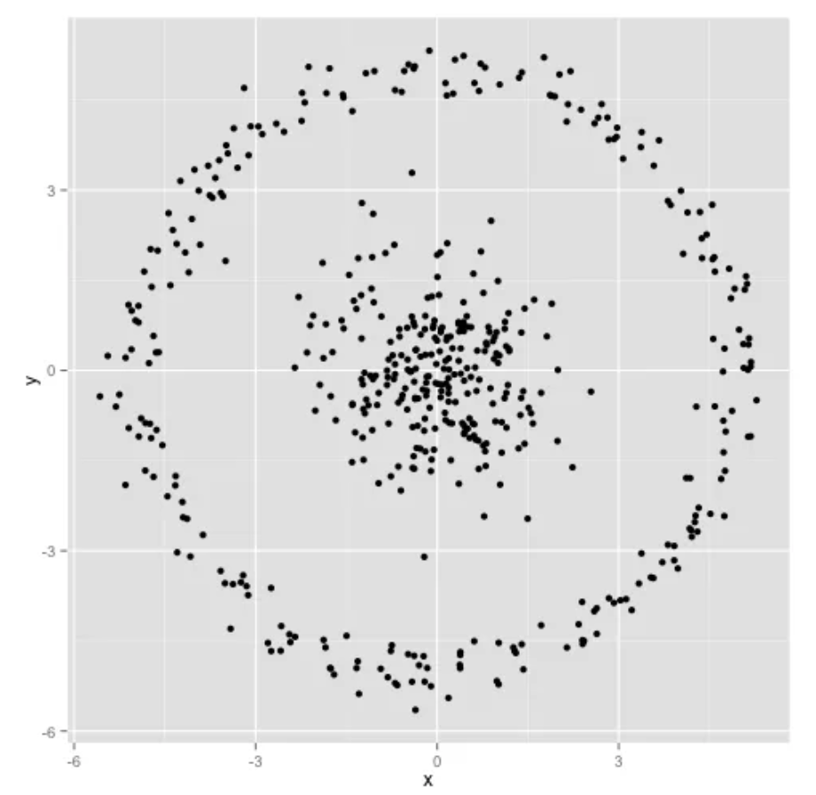
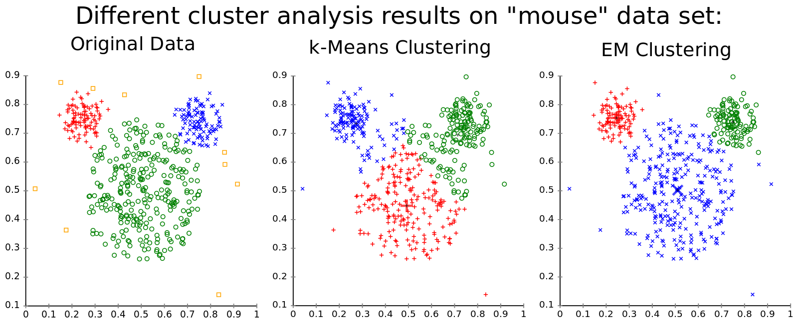

1. What are the basic assumptions to be made for linear regression?
2. What happens if we don’t apply feature scaling to logistic regression?
3. What are the algorithms you’d use when developing the prototype of a fraud detection model?
4. Feature selection.
    1. Why do we use feature selection?
    1. What are some of the algorithms for feature selection? Pros and cons of each.
5. k-means clustering.
    1. How would you choose the value of k?
    1. If the labels are known, how would you evaluate the performance of your k-means clustering algorithm?
    1. How would you do it if the labels aren’t known?
    1. Given the following dataset, can you predict how K-means clustering works on it? Explain.
    
6. k-nearest neighbor classification.
    1. How would you choose the value of k?
    1. What happens when you increase or decrease the value of k?
    1. How does the value of k impact the bias and variance?
7. k-means and GMM are both powerful clustering algorithms.
    1. Compare the two.
    1. When would you choose one over another?

8. Bagging and boosting are two popular ensembling methods. Random forest is a bagging example while XGBoost is a boosting example.
    1. What are some of the fundamental differences between bagging and boosting algorithms?
    1. How are they used in deep learning?
9. Given this directed graph.
[img](dag.png)
    1. Construct its adjacency matrix.
    1. How would this matrix change if the graph is now undirected?
    1. What can you say about the adjacency matrices of two isomorphic graphs?
10. Imagine we build a user-item collaborative filtering system to recommend to each user items similar to the items they’ve bought before.
    1. You can build either a user-item matrix or an item-item matrix. What are the pros and cons of each approach?
    1. How would you handle a new user who hasn’t made any purchases in the past?
11. Is feature scaling necessary for kernel methods?
12. Naive Bayes classifier.
    1. How is Naive Bayes classifier naive?
    1. Let’s try to construct a Naive Bayes classifier to classify whether a tweet has a positive or negative sentiment. We have four training samples:
    ```math
    \begin{bmatrix} 
        Tweet & Label \\
        This makes me so upset & Negative\\
        This puppy makes me happy & Positive \\
        Look at this happy hamster & Positive \\
        No hamsters allowed in my house	 & Negative
        \end{bmatrix}
    ```
    According to your classifier, what's sentiment of the sentence The hamster is upset with the puppy?
13. Two popular algorithms for winning Kaggle solutions are Light GBM and XGBoost. They are both gradient boosting algorithms.
    1. What is gradient boosting?
    1. What problems is gradient boosting good for?
14. SVM.
    1. What’s linear separation? Why is it desirable when we use SVM?
    [img](svm1.png)
    1. How well would vanilla SVM work on this dataset?
    [img](svm2.png)
    1. How well would vanilla SVM work on this dataset?
    [img](svm3.png)
    1. ow well would vanilla SVM work on this dataset?
    [img](svm4.png)