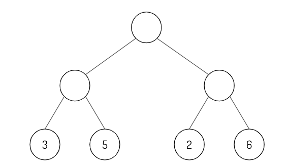
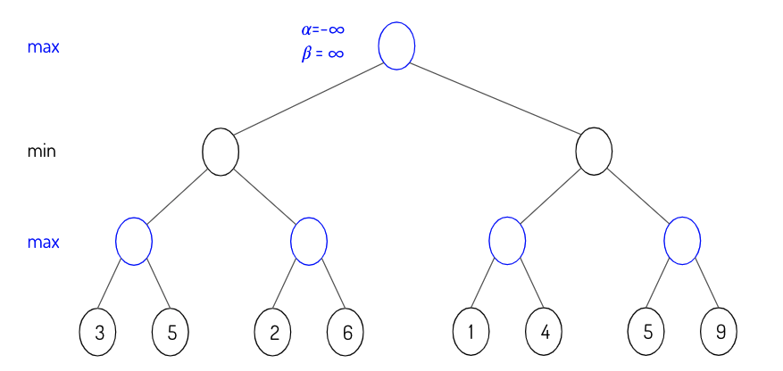

# Deep Learning Questions
----
## Contents
- [Training a Neural Network](#training-a-neural-network)
- [Natural Language Processing](#natural-language-processing)
- [Coputer Vision](#computer-vision)
- [Reinforcement Learning](#reinforcement-learning)
- [Advanced Topics](#advanced-topics)

----

## Training a Neural Network

1. When building a neural network, should you overfit or underfit it first?
2.  Write the vanilla gradient update.
3. Neural network in simple Numpy.
    1. Write in plain NumPy the forward and backward pass for a two-layer feed-forward neural network with a ReLU layer in between.
    1. Implement vanilla dropout for the forward and backward pass in NumPy.
4. Activation functions.
    1. Draw the graphs for sigmoid, tanh, ReLU, and leaky ReLU.
    1. Pros and cons of each activation function.
    1. Is ReLU differentiable? What to do when it’s not differentiable?
    1. Derive derivatives for sigmoid function when is a vector.
5. What’s the motivation for skip connection in neural works?
6. Vanishing and exploding gradients.
    1. How do we know that gradients are exploding? How do we prevent it?
    1. Why are RNNs especially susceptible to vanishing and exploding gradients?
7. Weight normalization separates a weight vector’s norm from its gradient. How would it help with training?
8. When training a large neural network, say a language model with a billion parameters, you evaluate your model on a validation set at the end of every epoch. You realize that your validation loss is often lower than your train loss. What might be happening?
9. What criteria would you use for early stopping?
10. Gradient descent vs SGD vs mini-batch SGD.
11. It’s a common practice to train deep learning models using epochs: we sample batches from data without replacement. Why would we use epochs instead of just sampling data with replacement?
12. Your model’ weights fluctuate a lot during training. How does that affect your model’s performance? What to do about it?
13. Learning rate.
    1. Draw a graph number of training epochs vs training error for when the learning rate is:
        1. too high
        1. too low
        1. acceptable.
    1. What’s learning rate warmup? Why do we need it?
14. Compare batch norm and layer norm.
15. Why is squared L2 norm sometimes preferred to L2 norm for regularizing neural networks?
16. Some models use weight decay: after each gradient update, the weights are multiplied by a factor slightly less than 1. What is this useful for?
17. It’s a common practice for the learning rate to be reduced throughout the training.
    1. What’s the motivation?
    1. What might be the exceptions?
18. Batch size.
    1. What happens to your model training when you decrease the batch size to 1?
    1. What happens when you use the entire training data in a batch?
    1. How should we adjust the learning rate as we increase or decrease the batch size?
19. Why is Adagrad sometimes favored in problems with sparse gradients?
20. Adam vs. SGD.
    1. What can you say about the ability to converge and generalize of Adam vs. SGD?
    2. What else can you say about the difference between these two optimizers?
21. With model parallelism, you might update your model weights using the gradients from each machine asynchronously or synchronously. What are the pros and cons of asynchronous SGD vs. synchronous SGD?
22. Why shouldn’t we have two consecutive linear layers in a neural network?
23. Can a neural network with only RELU (non-linearity) act as a linear classifier?
24. Design the smallest neural network that can function as an XOR gate.
25. Why don’t we just initialize all weights in a neural network to zero?
26. Stochasticity.
    1. What are some sources of randomness in a neural network?
    1. Sometimes stochasticity is desirable when training neural networks. Why is that?
27. Dead neuron.
    1. What’s a dead neuron?
    1. How do we detect them in our neural network?
    1. How to prevent them?
28. Pruning.
    1. Pruning is a popular technique where certain weights of a neural network are set to 0. Why is it desirable?
    2. How do you choose what to prune from a neural network?
29. Under what conditions would it be possible to recover training data from the weight checkpoints?
30. Why do we try to reduce the size of a big trained model through techniques such as knowledge distillation instead of just training a small model from the beginning?

---

## Natural Language Processing

1. RNNs
    1. What’s the motivation for RNN?
    1. What’s the motivation for LSTM?
    1. How would you do dropouts in an RNN?
2. What’s density estimation? Why do we say a language model is a density estimator?
3. Language models are often referred to as unsupervised learning, but some say its mechanism isn’t that different from supervised learning. What are your thoughts?
4. Word embeddings.
    1. Why do we need word embeddings?
    1. What’s the difference between count-based and prediction-based word embeddings?
    1. Most word embedding algorithms are based on the assumption that words that appear in similar contexts have similar meanings. What are some of the problems with context-based word embeddings?
5. Given 5 documents:
     
    ```
     D1: The duck loves to eat the worm
     D2: The worm doesn’t like the early bird
     D3: The bird loves to get up early to get the worm
     D4: The bird gets the worm from the early duck
     D5: The duck and the birds are so different from each other but one thing they have in common is that they both get the worm
    ```
        1. Given a query Q: “The early bird gets the worm”, find the two top-ranked documents according to the TF/IDF rank using the cosine similarity measure and the term set {bird, duck, worm, early, get, love}. Are the top-ranked documents relevant to the query?
        2. Assume that document D5 goes on to tell more about the duck and the bird and mentions “bird” three times, instead of just once. What happens to the rank of D5? Is this change in the ranking of D5 a desirable property of TF/IDF? Why?
7. Your client wants you to train a language model on their dataset but their dataset is very small with only about 10,000 tokens. Would you use an n-gram or a neural language model?
8. For n-gram language models, does increasing the context length (n) improve the model’s performance? Why or why not?
9. What problems might we encounter when using softmax as the last layer for word-level language models? How do we fix it?
10. What's the Levenshtein distance of the two words “doctor” and “bottle”?
11. BLEU is a popular metric for machine translation. What are the pros and cons of BLEU?
12. On the same test set, LM model A has a character-level entropy of 2 while LM model A has a word-level entropy of 6. Which model would you choose to deploy?
13. Imagine you have to train a NER model on the text corpus A. Would you make A case-sensitive or case-insensitive?
14. Why does removing stop words sometimes hurt a sentiment analysis model?
15. Many models use relative position embedding instead of absolute position embedding. Why is that?
16. Some NLP models use the same weights for both the embedding layer and the layer just before softmax. What’s the purpose of this?

---

## Computer Vision


1. For neural networks that work with images like VGG-19, InceptionNet, you often see a visualization of what type of features each filter captures. How are these visualizations created?
2. Filter size.
    1. How are your model’s accuracy and computational efficiency affected when you decrease or increase its filter size?
    1. How do you choose the ideal filter size?
3. Convolutional layers are also known as “locally connected.” Explain what it means.
4. When we use CNNs for text data, what would the number of channels be for the first conv layer?
5. What is the role of zero padding?
6. Why do we need upsampling? How to do it?
7. What does a 1x1 convolutional layer do?
8. Pooling.
    1. What happens when you use max-pooling instead of average pooling?
    1. When should we use one instead of the other?
    1. What happens when pooling is removed completely?
    1. What happens if we replace a 2 x 2 max pool layer with a conv layer of stride 2?
9. When we replace a normal convolutional layer with a depthwise separable convolutional layer, the number of parameters can go down. How does this happen? Give an example to illustrate this.
10. Can you use a base model trained on ImageNet (image size 256 x 256) for an object classification task on images of size 320 x 360? How?
11. How can a fully-connected layer be converted to a convolutional layer?
12. Pros and cons of FFT-based convolution and Winograd-based convolution.

----

## Reinforcement Learning

1. Explain the explore vs exploit tradeoff with examples.
2. How would a finite or infinite horizon affect our algorithms?
3. Why do we need the discount term for objective functions?
4. Fill in the empty circles using the minimax algorithm.

   
  
7. Fill in the alpha and beta values as you traverse the minimax tree from left to right.

      
  
10. Given a policy, derive the reward function.
11. Pros and cons of on-policy vs. off-policy.
12. What’s the difference between model-based and model-free? Which one is more data-efficient?

----

## Advanced Topics

1. An autoencoder is a neural network that learns to copy its input to its output. When would this be useful?
2. Self-attention.
    1. What’s the motivation for self-attention?
    1. Why would you choose a self-attention architecture over RNNs or CNNs?
    1. Why would you need multi-headed attention instead of just one head for attention?
    1. How would changing the number of heads in multi-headed attention affect the model’s performance?
3. Transfer learning
    1. You want to build a classifier to predict sentiment in tweets but you have very little labeled data (say 1000). What do you do?
    1. What’s gradual unfreezing? How might it help with transfer learning?
4. Bayesian methods.
    1. How do Bayesian methods differ from the mainstream deep learning approach?
    1. How are the pros and cons of Bayesian neural networks compared to the mainstream neural networks?
    1. Why do we say that Bayesian neural networks are natural ensembles?
5. GANs.
    1. What do GANs converge to?
    1. Why are GANs so hard to train?
