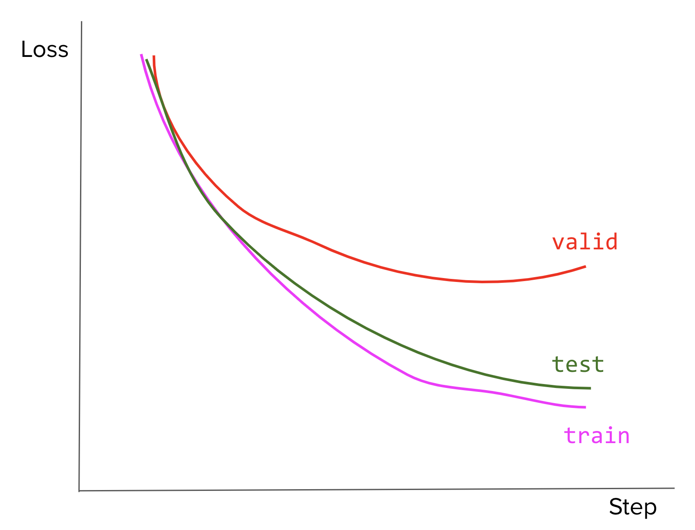

# Machine Learning Workflows Questions

## Contens
- [Basics](#basics)
- [Sampling and Creating Training Data](#sampling-and-creating-training-data)
- [Objective Functions, Metrics, and Evaluation](#objective-functions,-metrics,-and-evaluation)

## Basics

1. Explain supervised, unsupervised, weakly supervised, semi-supervised, and active learning.
2. Empirical risk minimization.
    1. What’s the risk in empirical risk minimization?
    1. Why is it empirical?
    1. How do we minimize that risk?
3. Occam's razor states that when the simple explanation and complex explanation both work equally well, the simple explanation is usually correct. How do we apply this principle in ML?
4. What are the conditions that allowed deep learning to gain popularity in the last decade?
5. If we have a wide NN and a deep NN with the same number of parameters, which one is more expressive and why?
6. The Universal Approximation Theorem states that a neural network with 1 hidden layer can approximate any continuous function for inputs within a specific range. Then why can’t a simple neural network reach an arbitrarily small positive error?
7. What are saddle points and local minima? Which are thought to cause more problems for training large NNs?
8. Hyperparameters.
    1. What are the differences between parameters and hyperparameters?
    1. Why is hyperparameter tuning important?
    1. Explain algorithm for tuning hyperparameters.
9. Classification vs. regression.
    1. What makes a classification problem different from a regression problem?
    1. Can a classification problem be turned into a regression problem and vice versa?
10. Parametric vs. non-parametric methods.
    1. What’s the difference between parametric methods and non-parametric methods? Give an example of each method.
    1. When should we use one and when should we use the other?
11. Why does ensembling independently trained models generally improve performance?
12. Why does L1 regularization tend to lead to sparsity while L2 regularization pushes weights closer to 0?
13. Why does an ML model’s performance degrade in production?
14. What problems might we run into when deploying large machine learning models?
15. Your model performs really well on the test set but poorly in production.
    1. What are your hypotheses about the causes?
    1. How do you validate whether your hypotheses are correct?
    1. Imagine your hypotheses about the causes are correct. What would you do to address them?

## Sampling and Creating Training Data

1. If you have 6 shirts and 4 pairs of pants, how many ways are there to choose 2 shirts and 1 pair of pants?
2. What is the difference between sampling with vs. without replacement? Name an example of when you would use one rather than the other?
3. Explain Markov chain Monte Carlo sampling.
4. If you need to sample from high-dimensional data, which sampling method would you choose?
5. Suppose we have a classification task with many classes. An example is when you have to predict the next word in a sentence -- the next word can be one of many, many possible words. If we have to calculate the probabilities for all classes, it’ll be prohibitively expensive. Instead, we can calculate the probabilities for a small set of candidate classes. This method is called candidate sampling. Name and explain some of the candidate sampling algorithms.
6. Suppose you want to build a model to classify whether a Reddit comment violates the website’s rule. You have $10$ million unlabeled comments from $10K$ users over the last $24$ months and you want to label $100K$ of them.
    1. How would you sample $100K$ comments to label?
    1. Suppose you get back $100K$ labeled comments from $20$ annotators and you want to look at some labels to estimate the quality of the labels. How many labels would you look at? How would you sample them?

7. Suppose you work for a news site that historically has translated only $1%$ of all its articles. Your coworker argues that we should translate more articles into Chinese because translations help with the readership. On average, your translated articles have twice as many views as your non-translated articles. What might be wrong with this argument?
8. How to determine whether two sets of samples (e.g. train and test splits) come from the same distribution?
9. How do you know you’ve collected enough samples to train your ML model?
10. How to determine outliers in your data samples? What to do with them?
11. Sample duplication
    1. When should you remove duplicate training samples? When shouldn’t you?
    1. What happens if we accidentally duplicate every data point in your train set or in your test set?
12. Missing data
    1. In your dataset, two out of 20 variables have more than 30% missing values. What would you do?
    1. How might techniques that handle missing data make selection bias worse? How do you handle this bias?
13. Why is randomization important when designing experiments (experimental design)?
14. Class imbalance.
    1. How would class imbalance affect your model?
    1. Why is it hard for ML models to perform well on data with class imbalance?
    1. Imagine you want to build a model to detect skin legions from images. In your training dataset, only $1%$ of your images shows signs of legions. After training, your model seems to make a lot more false negatives than false positives. What are some of the techniques you'd use to improve your model?
15. Training data leakage.
    1. Imagine you're working with a binary task where the positive class accounts for only 1% of your data. You decide to oversample the rare class then split your data into train and test splits. Your model performs well on the test split but poorly in production. What might have happened?
    1. You want to build a model to classify whether a comment is spam or not spam. You have a dataset of a million comments over the period of 7 days. You decide to randomly split all your data into the train and test splits. Your co-worker points out that this can lead to data leakage. How?
16. How does data sparsity affect your models?
17. Feature leakage
    1. What are some causes of feature leakage?
    1. Why does normalization help prevent feature leakage?
    1. How do you detect feature leakage?
18. Suppose you want to build a model to classify whether a tweet spreads misinformation. You have 100K labeled tweets over the last 24 months. You decide to randomly shuffle on your data and pick 80% to be the train split, 10% to be the valid split, and 10% to be the test split. What might be the problem with this way of partitioning?
19. You’re building a neural network and you want to use both numerical and textual features. How would you process those different features?
20. Your model has been performing fairly well using just a subset of features available in your data. Your boss decided that you should use all the features available instead. What might happen to the training error? What might happen to the test error?


## Objective Functions, Metrics, and Evaluation


1. Convergence.
    1. When we say an algorithm converges, what does convergence mean?
    1. How do we know when a model has converged?
2. Draw the loss curves for overfitting and underfitting.
3. Bias-variance trade-off
    1.  What’s the bias-variance trade-off?
    1. How’s this tradeoff related to overfitting and underfitting?
    1. How do you know that your model is high variance, low bias? What would you do in this case?
    1. How do you know that your model is low variance, high bias? What would you do in this case?
4. Cross-validation.
    1. Explain different methods for cross-validation.
    1. Why don’t we see more cross-validation in deep learning?
5. Train, valid, test splits.
    1. What’s wrong with training and testing a model on the same data?
    1. Why do we need a validation set on top of a train set and a test set?
    1. Your model’s loss curves on the train, valid, and test sets look like this. What might have been the cause of this? What would you do?
    

6. Your team is building a system to aid doctors in predicting whether a patient has cancer or not from their X-ray scan. Your colleague announces that the problem is solved now that they’ve built a system that can predict with 99.99% accuracy. How would you respond to that claim?
7. F1 score.
    1. What’s the benefit of F1 over the accuracy?
    1. Can we still use F1 for a problem with more than two classes. How?
8. Given a binary classifier that outputs the following confusion matrix.

```math
\begin{bmatrix} 
	"" & Predicted True & Predicted False \\
	Actual True & 30 & 20\\
	Actual False & 5 & 40 \\
	\end{bmatrix}
```
    1. Calculate the model’s precision, recall, and F1.
    1. What can we do to improve the model’s performance?

9. Consider a classification where $99%$ of data belongs to class A and $1%$ of data belongs to class B.
    1. If your model predicts A 100% of the time, what would the F1 score be? Hint: The F1 score when A is mapped to 0 and B to 1 is different from the F1 score when A is mapped to 1 and B to 0.
    1. If we have a model that predicts A and B at a random (uniformly), what would the expected $F_1$ be?
10. For logistic regression, why is log loss recommended over MSE (mean squared error)?
11. When should we use RMSE (Root Mean Squared Error) over MAE (Mean Absolute Error) and vice versa?
12. Show that the negative log-likelihood and cross-entropy are the same for binary classification tasks.
13. For classification tasks with more than two labels (e.g. MNIST with $10$ labels), why is cross-entropy a better loss function than MSE?
14. Consider a language with an alphabet of $27$ characters. What would be the maximal entropy of this language?
15. A lot of machine learning models aim to approximate probability distributions. Let’s say P is the distribution of the data and Q is the distribution learned by our model. How do measure how close Q is to P?
16. MPE (Most Probable Explanation) vs. MAP (Maximum A Posteriori)
    1. How do MPE and MAP differ?
    1. Give an example of when they would produce different results.
17. Suppose you want to build a model to predict the price of a stock in the next 8 hours and that the predicted price should never be off more than $10%$ from the actual price. Which metric would you use?